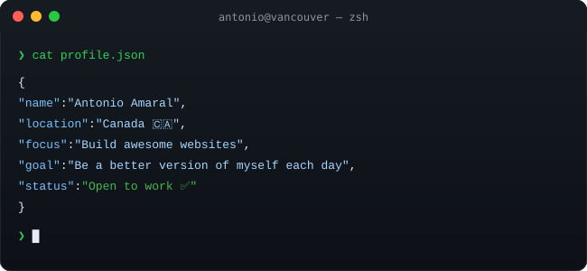
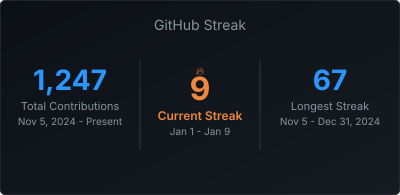

<!-- 
╔══════════════════════════════════════════════════════════════════════════════╗
║                                                                              ║
║   ANTONIO AMARAL — FULLSTACK DEVELOPER — VANCOUVER, BC                      ║
║                                                                              ║
╚══════════════════════════════════════════════════════════════════════════════╝
-->

<div align="center">

  

  <br/>

  <a href="https://github.com/AntonioDev72">
    
  </a>
  &nbsp;
  <a href="https://github.com/AntonioDev72?tab=repositories">
    
  </a>
  &nbsp;
  <a href="https://github.com/AntonioDev72?tab=followers">
    
  </a>
  &nbsp;
  <a href="https://github.com/AntonioDev72">
    
  </a>

</div>

<br/>

<div align="center">
  
</div>

<br/>


<br/>


<br/><br/>

<table>
<tr>
<td width="55%" valign="top">

### 🎯 What I Do

```yaml
name: Antonio Amaral
located_in: Vancouver, BC 🍁
current_status: Fullstack Developer

areas_of_expertise:
  - ⚛️ React & Frontend Development
  - 🟢 Node.js & Backend APIs
  - 🍃 MongoDB & Databases
  - 🔐 JWT Authentication
  - 🚀 Fullstack Web Applications

currently_building:
  - TaskFlow — Fullstack task manager
  - CineSearch — Movie discovery app
  - DevFlow — Pomodoro timer for devs

life_philosophy: "Ship it. Improve it. Repeat. 🚀"
```

</td>
<td width="45%" valign="top">

### 🚀 Current Focus

- 💼 **Looking for** first tech role in Vancouver
- 📚 **Studying** Fullstack Dev @ Greystone College
- 🌐 **Building** real-world web applications
- 🔐 **Mastering** authentication & security
- 🌱 **Always learning** new technologies
- ☕ **Fueled** by coffee & curiosity

<br/>

### 💡 Quick Facts

- 🇧🇷 Brazilian living in Vancouver 🇨🇦
- 🎓 Greystone College student
- 🔥 Passionate about clean code
- 🌟 Open to work opportunities

</td>
</tr>
</table>

<br/>


<br/>


<br/><br/>

<div align="center">

  <a href="https://github.com/ryo-ma/github-profile-trophy">
    
  </a>

</div>

<br/>


<br/>


<br/><br/>

<div align="center">

  <a href="https://github.com/AntonioDev72">
    
  </a>
  &nbsp;
  <a href="https://github.com/AntonioDev72">
    
  </a>

  <br/><br/>

  <a href="https://github.com/AntonioDev72">
    
  </a>

  <br/><br/>

  <a href="https://github.com/AntonioDev72">
    
  </a>

  <br/><br/>

  

</div>

<br/>


<br/>


<br/><br/>

<div align="center">

  <picture>
    <source media="(prefers-color-scheme: dark)" srcset="./assets/pacman-contribution-graph-dark.svg"/>
    <source media="(prefers-color-scheme: light)" srcset="./assets/pacman-contribution-graph.svg"/>
    
  </picture>

  <br/>

  <sub>👾 Watch Pac-Man devour my contributions!</sub>

</div>

<br/>


<br/>


<br/><br/>

<div align="center">

<h4>🌐 Frontend</h4>
<p>
  <a href="https://reactjs.org/" target="_blank"></a>
  <a href="https://developer.mozilla.org/en-US/docs/Web/JavaScript" target="_blank"></a>
  <a href="https://developer.mozilla.org/en-US/docs/Web/HTML" target="_blank"></a>
  <a href="https://developer.mozilla.org/en-US/docs/Web/CSS" target="_blank"></a>
  <a href="https://vitejs.dev/" target="_blank"></a>
</p>

<h4>⚙️ Backend</h4>
<p>
  <a href="https://nodejs.org/" target="_blank"></a>
  <a href="https://expressjs.com/" target="_blank"></a>
  <a href="https://www.mongodb.com/" target="_blank"></a>
</p>

<h4>🔧 Tools & Platforms</h4>
<p>
  <a href="https://git-scm.com/" target="_blank"></a>
  <a href="https://github.com/" target="_blank"></a>
  <a href="https://code.visualstudio.com/" target="_blank"></a>
  <a href="https://vercel.com/" target="_blank"></a>
  <a href="https://www.postman.com/" target="_blank"></a>
</p>

</div>

<br/>


<br/>

<div align="center">

### ⚡ Currently Building & Learning

<br/>

<a href="https://taskflow-seven-bice.vercel.app" target="_blank">
  
</a>
&nbsp;
<a href="https://cineflix-alpha-ruddy.vercel.app" target="_blank">
  
</a>
&nbsp;
<a href="https://dev-flow-five-kappa.vercel.app" target="_blank">
  
</a>

</div>

<br/>


<br/>


<br/><br/>

<div align="center">

<a href="https://github.com/AntonioDev72" target="_blank">
  
</a>
&nbsp;
<a href="https://linkedin.com/in/antonio-amaral" target="_blank">
  
</a>
&nbsp;
<a href="mailto:toinhoamaral.aa@gmail.com">
  
</a>
&nbsp;
<a href="https://antonio-portfolio.vercel.app" target="_blank">
  
</a>

</div>

<br/>


<br/>

<div align="center">

### 💭 Random Dev Quote

<br/>

<a href="https://github.com/AntonioDev72">
  
</a>

</div>

<br/>

<div align="center">

  

  <br/>

  

</div>
